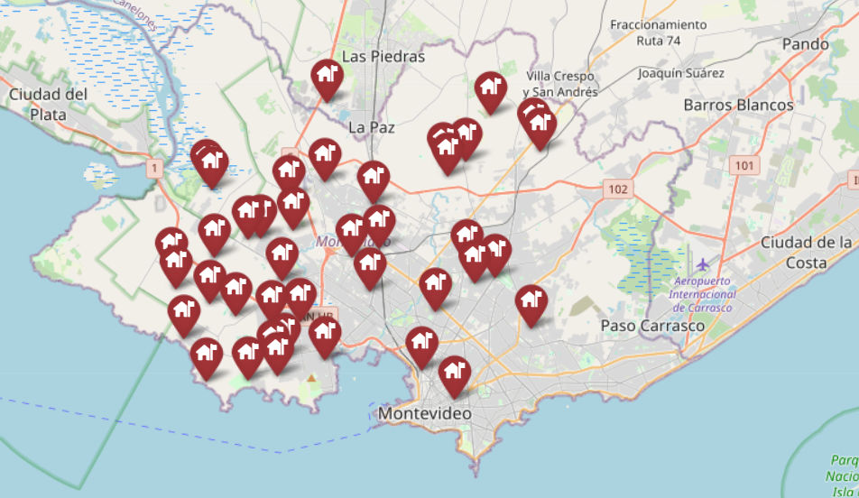
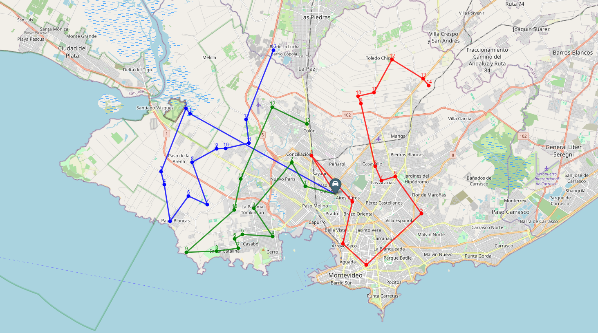
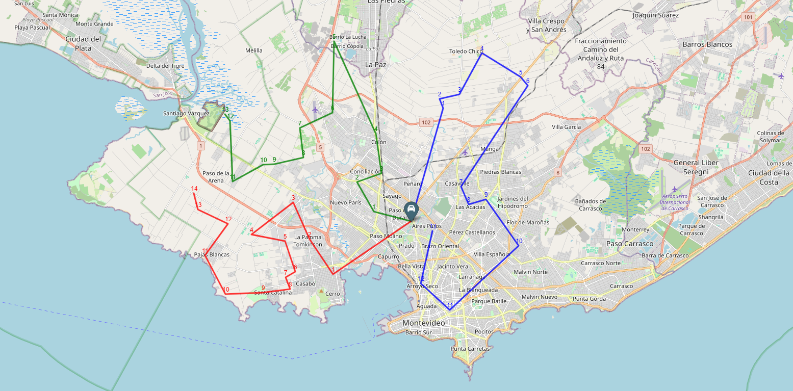

# Asignación óptima de móviles ante saltos de alarma mediante algoritmos genéticos

Este proyecto presenta una solución al problema de asignación de móviles de respuesta frente a eventos simultáneos, como los saltos de alarma en sistemas de seguridad urbana. El enfoque se basa en el uso de **algoritmos genéticos** para planificar rutas eficientes, minimizando el tiempo total de respuesta y balanceando la carga entre los móviles disponibles.

---

## 📍 Contexto

El escenario planteado consiste en 40 alarmas activadas simultáneamente en distintas zonas de **Montevideo, Uruguay**, las cuales deben ser atendidas por **3 móviles** que parten desde una base común. El objetivo es encontrar una asignación óptima que reduzca el tiempo total estimado de respuesta y garantice una distribución operativa equilibrada.

---

## ⚙️ Solución implementada

- Se modela el problema como una versión **estática** del VRP (Vehicle Routing Problem), sin aparición dinámica de eventos.
- Se utiliza un **algoritmo genético** con operadores de selección por torneo, cruce tipo OX (Order Crossover) y mutación por intercambio.
- El cálculo de fitness considera:
  - La distancia euclidiana entre puntos geográficos.
  - La conversión a tiempo estimado usando una velocidad promedio de 45 km/h.
  - Una penalización adicional por desbalance entre móviles.

---

## 🧠 Optimización de hiperparámetros

Se integra la herramienta [Optuna](https://optuna.org/) para encontrar automáticamente la mejor combinación de hiperparámetros del modelo (tasa de mutación, tamaño de población, penalización por desbalance, etc.), logrando una mejora adicional significativa en la calidad de las soluciones obtenidas.

---

## 🗺️ Visualizaciones geoespaciales

A continuación se muestran algunos mapas generados con la biblioteca `folium`, que representan:

### 🔹 Puntos de alarma simulados

---

### 🔹 Rutas optimizadas con parámetros iniciales

---

### 🔹 Rutas optimizadas con hiperparámetros ajustados por Optuna

---

## 📈 Resultados destacados

- Fitness solución aleatoria: **617.94 minutos**
- Fitness con AG (sin optimización): **173.64 minutos**
- Fitness con AG + Optuna: **158.19 minutos**

Esto representa una mejora **superior al 70%** en tiempo operativo respecto a una asignación aleatoria.

---

## 📂 Contenido del repositorio

- `asignacion_moviles.ipynb`: Notebook completo con el código, visualizaciones y pruebas.
- `document.pdf`: Informe técnico con la descripción detallada del problema, la implementación y los resultados.
- Imágenes de mapas y rutas generadas.

---

## 🏁 Conclusión

Este trabajo demuestra cómo un enfoque basado en algoritmos evolutivos, acompañado de visualización geográfica y ajuste automatizado de parámetros, puede ser efectivo en la planificación operativa de servicios de respuesta ante eventos simultáneos. La solución es fácilmente extensible a otros contextos como logística, delivery o emergencias.

---

_Carrera de Especialización en Inteligencia Artificial (CEIA) – Facultad de Ingeniería – Universidad de Buenos Aires (FIUBA)_
